# DieWan

### Infrastructure for an Accountability Economy

**Authority stated. Action proven. Responsibility preserved.**

DieWan explores systems in which consequential digital actions carry verifiable evidence of what was authorized, what occurred, and who or what remains responsible.

  

---

## The larger idea

Today's digital economy is very good at recording transactions and much weaker at preserving accountability.

An action may be technically valid while its authority, purpose, and responsibility remain unclear. An automated agent may have permission to act without leaving durable evidence that its specific action matched the mandate it received.

We call the alternative an **Accountability Economy**: an economy where valuable actions can carry portable, independently verifiable evidence of:

- **Mandate** — what was authorized, by whom, and under which limits
- **Action** — what actually happened
- **Receipt** — the evidence binding the action to its mandate
- **Responsibility** — who or what remains answerable for the result

The goal is not more surveillance or merely more logs. It is better-structured proof: evidence that can be checked without surrendering judgment to a central intermediary.

## What DieWan is exploring

| Layer | Question |
|---|---|
| **Sanads** | What right, claim, mandate, or responsibility is being carried? |
| **Single-use seals** | How is reuse, replay, or double exercise prevented? |
| **Proofs and receipts** | What evidence shows that an authorized transition occurred? |
| **Client-side validation** | Can the receiver verify the evidence independently? |
| **Agent accountability** | Can automated actions be bound to explicit human or institutional authority? |
| **Developer infrastructure** | Can these guarantees become usable building blocks for digital systems? |

A **sanad** is DieWan's working term for a proof-carrying digital instrument: not merely a token, but a portable container for rights, claims, provenance, mandates, and transfer conditions.

## Why client-side validation

Many systems make a platform, custodian, bridge, or committee the final judge of validity.

DieWan investigates a different model:

1. A right or mandate is represented in client-held state.
2. A single-use seal constrains how it may be exercised.
3. An action consumes or updates that state.
4. A proof bundle records the transition.
5. The receiver verifies the evidence before accepting the result.

**Proof travels. Custody does not.**

The aim is to preserve local verification across heterogeneous systems without pretending they all share one machine, one authority, or one trust model.

## Design principles

- **Mandate before action.** Permission should be explicit enough to test.
- **Receipts after action.** Consequences should leave durable, verifiable evidence.
- **Verification over attestation.** A verifier should inspect proof, not merely inherit confidence.
- **Native guarantees over simulated universality.** Each system's real security properties must remain visible.
- **Client state over unnecessary global state.** Not every private fact must become universal consensus.
- **Minimal authority surfaces.** Every added intermediary creates another place where responsibility can disappear.
- **Honest status over premature certainty.** Research claims and production guarantees are not the same thing.

## Current status

DieWan is an early-stage research and engineering organization. The Accountability Economy is an emerging thesis, not yet a finished standard.

The public [`csv-adapter`](https://github.com/diewan/csv-adapter) repository is an archived record of an earlier implementation direction. It remains available for historical and technical context; it is not a production release.

Public specifications, threat models, reference implementations, and integration materials will appear when they are ready to be evaluated and depended upon.

## A simple standard for the work

For every consequential digital action, we want to be able to ask:

> Who authorized this? What exactly was authorized? What happened? What proves the match? Who remains responsible?

If a system cannot answer those questions, technical validity alone is not enough.

---

**Verify before accepting. Preserve responsibility after execution.**

